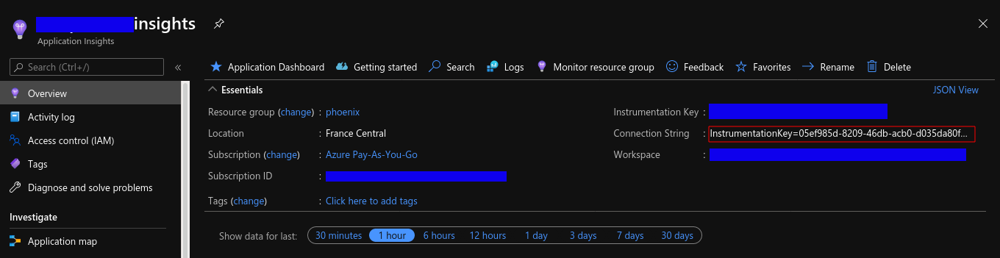

# Azure Digital Twins connector
The aim of this project is to :
 - read data from an ADT
 - flatten these data in a list of CSVData Pojo defined in the library simulator-connector-commons
 - Export Csv Files containing these data

## Change logs
### Version 2.0.1
* Fix an issue with unexisting target directories
* Added Cosmo Tech Digital Twins Platform manifest for the connector in platform/Connector.yaml
### Version 2.0.0
* Change of target directory property and Env var
export.csv.file.absolute.path -> csm.fetch.absolute.path
EXPORT_CSV_FILE_ABSOLUTE_PATH -> CSM_FETCH_ABSOLUTE_PATH
* use simulator-connector-commons which now default target directory to /mnt/scenariorun-data/
* Add a / at the end of target path if not present
* Remove Application Insights Java Agent
* Watcher for build
* Default registry is localhost:5000
* Github packaging workflow to ghcr.io
* Dependencies updates

## Properties to overwrite :
Here is the list of properties that should be changed (in ```META-INF/microprofile-config.properties``` file):
- **azure.client.id**
- **azure.tenant.id**
- **azure.client.secret**
- **azure.digital.twins.url**
- **csm.fetch.absolute.path**

If you want to overwrite these properties, you can write your own property values in the ```META-INF/microprofile-config.properties``` file, or set a property's system, or an environment variable named :
- **AZURE_CLIENT_ID** : the Azure client id (can be found under the App registration screen)
- **AZURE_TENANT_ID** : the Azure Tenant id (can be found under the App registration screen)
- **AZURE_CLIENT_SECRET** : the app client secret (can be found under the App registration/certificates and secrets screen)
- **AZURE_DIGITAL_TWINS_URL** : the url of the ADT targeted (can be found in the specific resource screen)
- **CSM_FETCH_ABSOLUTE_PATH** : the absolute path to export all csv files (don't forget the / at the end)

## Log level
Default log level defined is "info".
We use the logging API [log4j2](https://logging.apache.org/log4j/2.x/manual/index.html).
You can change the log threshold by setting an environment variable named: **LOG_THRESHOLD_LEVEL**.
Log levels used for identifying the severity of an event. Log levels are organized from most specific to least:
- OFF (most specific, no logging)
- FATAL (most specific, little data)
- ERROR
- WARN
- INFO
- DEBUG
- TRACE (least specific, a lot of data)
- ALL (least specific, all data)


## Application insights
*FEATURE IS DISABLED IN V2*
The connector comes with a javaagent for adding connector's outputs to an application insights.

Create an application insight through portal.azure and set the connection string into the file ```/src/main/jib/applicationinsights.json```



##Change the default container registry

Modify the pom.xml or set options directly in jib:build command
```
See [Jib project Configuration]("https://github.com/GoogleContainerTools/jib/tree/master/jib-maven-plugin#configuration") to set correctly your container registry (GCR, ECR, ACR, Docker Hub Registry)

Build your container image with:

```shell
mvn compile jib:build -Djib.allowInsecureRegistries=true
```

Subsequent builds are much faster than the initial build.

##Build to GitHub Registry
This project defines a GitHub workflow which build to ghcr.io. Example:
``` shell
mvn compile jib:build \
  -Djib.to.image="ghcr.io/cosmo-tech/azure-digital-twins-simulator-connector:latest" \
  -Djib.to.auth.username="${{ github.actor }}" \
  -Djib.to.auth.password="${GITHUB_TOKEN}"
```

#### Build to Docker daemon

Jib can also build your image directly to a Docker daemon. This uses the `docker` command line tool and requires that you have `docker` available on your `PATH`.

```shell
mvn compile jib:dockerBuild
```

For more information, see [Jib project Build]("https://github.com/GoogleContainerTools/jib/tree/master/jib-maven-plugin#build-your-image")

### Watch build
To watch for file modifications and do continuous build run
```shell
mvn fizzed-watcher:run
```

#### How to run your image locally 

```
docker run \ 
-v <<local_export_dir_path>>:/tmp \
-e CSM_FETCH_ABSOLUTE_PATH=/tmp/ \
-e AZURE_DIGITAL_TWINS_URL=https://XXX.XXX.XXX.digitaltwins.azure.net \
-e AZURE_TENANT_ID=<<azure_tenant_id>> \
-e AZURE_CLIENT_ID=<<azure_client_id>> \
-e AZURE_CLIENT_SECRET=<<azure_client_secret>> \
<your_container_registry>/azure-digital-twins-simulator-connector
```

You can find all export files under the directory "local_export_dir_path" specified above


## How-to

```
    <dependency>
      <groupId>com.github.Cosmo-Tech</groupId>
      <artifactId>azure-digital-twins-simulator-connector</artifactId>
      <version>1.0-SNAPSHOT</version>
    </dependency>
```

## Tasks : 

- [ ] Create a Dockerfile instead of using JIB (and manage applicationinsights-agent download in it)
- [ ] Add more logs (maybe with some metrics: e.g. amount of twins/relationships)
- [x] Handle properties on relationship
- [ ] Handle multiple extends 
